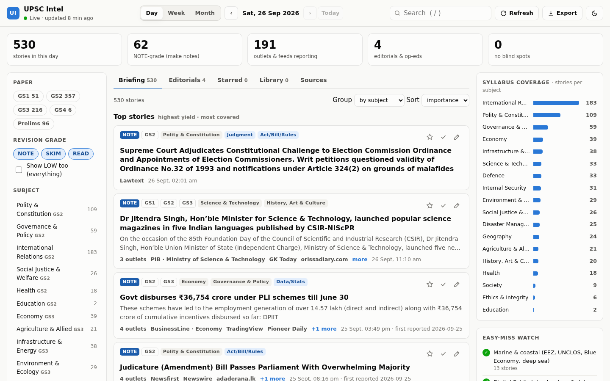
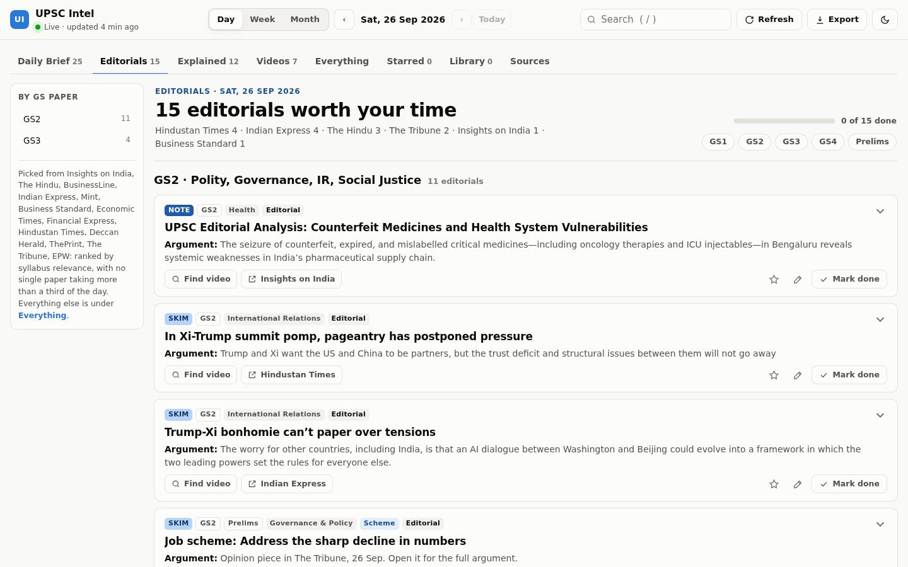
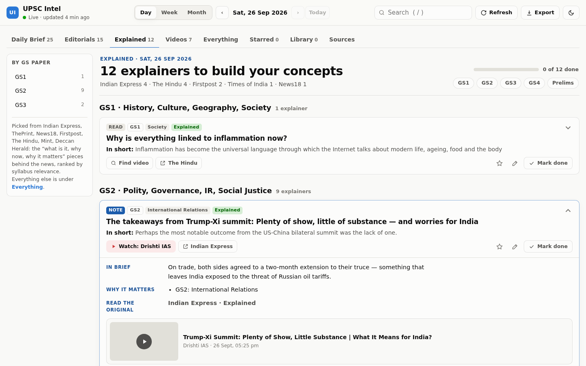
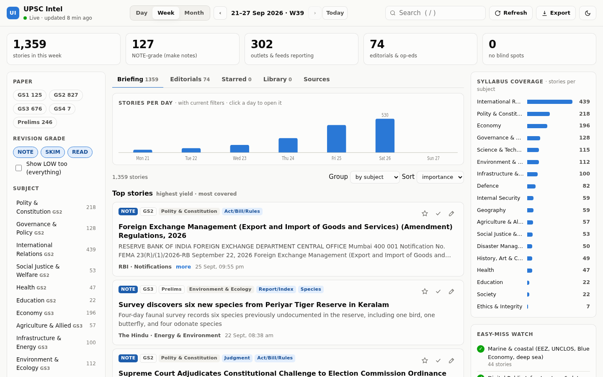
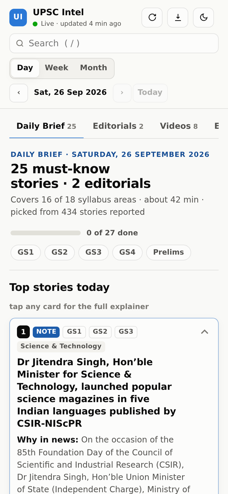

# UPSC Intel: live current-affairs dashboard

A self-updating website that reads **~140 sources** every 15 minutes and turns hundreds of
stories a day into a short **Daily Brief** you can actually finish. The sources include:
- PIB, RBI, SEBI, PRS and NITI
- The Hindu, Indian Express, Mint, BS, ET, HT and more
- 13 opinion pages and 7 explainer desks
- coaching desks (IE UPSC, Insights, ForumIAS, Drishti…)
- a 42-query Google News watchlist

For each day it picks about 20–25 must-know stories and 20 Prelims facts, plus 15 editorials and 12 explainers, balanced across the syllabus. Each one comes with:
- a UPSC-style explainer
- the closest-matching YouTube video

Week and Month views recap everything the daily briefs covered.



| Editorials (by GS paper) | Explained |
|---|---|
|  |  |

| Week in review | Phone |
|---|---|
|  |  |

## What you get

- **Daily Brief (the default view).** Every must-know story of the day, with no fixed number, picked from the 400–600 reported. A busy day (a summit, a Parliament session) has a long brief and a quiet day a short one.
  - **Must-know bar:**
    - Each story gets a brief score. That's its grade, lifted when the headline reports an examinable development (a Bill passed, an Act in force, a Cabinet approval, a pact signed, a named exercise, a species found, a GI tag, an index rank…) and lowered for reactions and commentary (says, slams, "Who is…", "Watch:", LIVE).
    - The rules live in `config/topics.yaml` → `brief`, next to the other rules.
  - **Laid out by grade** (website and app), each block with the grade pill it's named for:
    - **Must-know · Make notes:** only high-yield (NOTE) stories above the bar whose headline isn't a reaction, a preview, a spat or a niche case. Full cards with the summary, video and notes. Every card reads "Make notes".
      - **More to make notes on:** make-notes stories listed as one-liners (analysis pieces, or beyond the day's cards).
    - **Quick read:**
      - **Prelims facts** first: stories above the bar that report a concrete development (an exercise, an MoU signed, an Act in force, a Cabinet approval, a port or scheme, a species, a key verdict). Compact cards, each reading "Quick read".
      - **More quick reads** follow as one-liners, for the stories worth knowing the gist of.
    - **Background:** context, reactions, previews, appellant/bail cases and stories just below the bar. One-liners; tap a line for its summary and sources.
    - Editorials and Explained follow, then **Low** at the very bottom, folded away. With Intel AI's triage on, Low lists the stories the rules would have picked that Gemini graded 0 (not UPSC material), each with its reason, so you can check what it took out.
    - The one-liners (the old "Also in the news" list) sit in the block of their own grade.
    - Typical busy day (26 Sep 2026): 22 must-know + 26 Prelims facts + 70 lines.
  - **Nothing thin on a quiet day:** a light day is topped up to 20 cards (from the day's best Prelims facts, so Must-know stays NOTE-only) and 40 stories in all. Every syllabus area also gets its best story.
  - **Same event, one card:** reports of the same event from different outlets, which clustering kept apart, fold into one card. They're listed on it as "Also reported". Two shared rare names ("Tarang Shakti", "Nomadic Elephant", "Strait of Hormuz") are enough to fold; shared common words ("Cabinet approves", "sign MoU") are not.
  - **Editorials and explainers:** every SKIM-or-better piece, topped up to 15 editorials and 12 explainers.
  - **Measured, not guessed:** four days were hand-labelled for must-know events, one of them blind. The brief caught 87–95% of them. The old fixed 25-story brief caught 35–73%, and dropped the most on the busiest days.
  - **The rest:** everything graded NOTE, SKIM or READ stays in **Everything**. Each card there says whether it made the brief and in which tier.
  - **What's left out:**
    - another country's internal politics with no India link (e.g. Sri Lanka's constitutional amendments): rejected as not UPSC material
    - crime and celebrity stories
    - political spats
    - results notices, quizzes, routine Treasury-bill auctions and coaching "daily current affairs" roundups
    - regulators' case-by-case paperwork (SEBI settlement orders, recovery certificates), tenders, and department housekeeping (memento e-auctions, cleanliness drives)
  - **Each piece appears once:** exam-prep sites often repost an op-ed or explainer under its original headline. Such a copy joins the original, so the brief doesn't carry the same article twice.
  - **Days follow IST (India time).** The site always opens on today. Just after midnight the new day is nearly empty and says so, with a link to yesterday's brief. The header shows the last update's time in IST.
  - **Permanent archive:** three days after a month ends, its Briefs and stories are frozen as the site showed them and saved to the repository's `archive` branch. Every build publishes all archived months, so any past date stays one calendar tap away. The working database keeps only the last 45 days (`UPSC_KEEP_DAYS` in the workflow), so updates stay fast. Only public content is archived.
  - **Calendar:** tap the date in the header to pick any day. Days with news have a dot. Month and year menus jump anywhere at once, and the keyboard works too (arrows, Enter, Esc).
  - **Everything tab:** a story appears on every day it's in the news, but joins the brief once, on the day it was first reported. Every card says **"✓ In 26 Sep brief"** or why it isn't in the brief.
- **A write-up on every brief story,** in the format coaching notes use:
  - **Why in news** · **What happened** · **When** · **Where** · **Who** · **Background** · **Why it matters** · **Prelims facts** · **Mains question** · **Keywords**
  - **Without a key (the default)**, the write-up is built from what *all* the outlets covering the story published, with repeated lines dropped:
    - When, Where and Who list only the dates, places, people and bodies that appear in that text (e.g. "Amit Shah (Home Minister), Ministry of Home Affairs"). Nothing is made up.
    - A story that only headline-only feeds carried gets a short write-up.
  - With an Anthropic API key, Claude writes full notes from the fetched text, and never invents news facts.
- **Up to two YouTube videos per story, one ▶ English and one ▶ हिंदी:**
  1. **The library comes first:** 23 channels' feeds.
     - English: Sansad TV, PIB, DD India, The Hindu, Indian Express, WION, Drishti English, StudyIQ English, Vajiram & Ravi, NEXT IAS, PW OnlyIAS, Vision IAS, Sleepy Classes, ClearIAS, Prep together
     - Hindi: DD News, Drishti IAS, StudyIQ IAS, NEXT IAS Hindi, UPSC Wallah, Sanskriti IAS, Dhyeya TV, Khan Global Studies
  2. **Then YouTube search:** the story's key terms, then the same terms plus "UPSC" (accepted from UPSC channels only), then the terms plus "UPSC Hindi".
  3. **Hindi or English only.** Anything else is rejected:
     - other scripts (Tamil, Telugu, Malayalam, Bengali and so on)
     - titles that say "in Malayalam" and similar
     - channels named after another language or a state, e.g. "Mission IAS Malayalam", "News18 Bangla", "DD NEWS Telangana"
  4. **What counts as a match:**
     - Words are weighted by rarity, so "AFSPA" or "Cybercrime" count far more than "minister" or "art".
     - The video has to be from the story's week.
     - Channels outside the UPSC, official and national-news lists must match much more strongly.
     - Shorts, vlogs, quizzes, admissions and stock-tip videos are rejected.
  5. **When nothing is confident enough,** the card shows a **Find video** search button instead of a wrong link.
- **Editorials of the day (about 15):**
  - **Sources:**
    - The Hindu (Editorial, Lead, Op-Ed, Columns)
    - Indian Express (Editorials, Columns, Opinion)
    - HT (Editorials, Opinion, HT Insight)
    - ET (Editorial, Opinion)
    - Mint, BusinessLine, Business Standard, Financial Express, Deccan Herald, ThePrint, The Tribune and EPW
    - Insights' UPSC Editorial Analysis
  - **How they're ranked:** by syllabus relevance, with no paper taking more than a third of the day. The Editorials tab groups them by GS paper.
  - **Also caught:** opinion pieces that arrive through news feeds are recognised from their URL (`/opinion/`, `/editorials/`, `/columns/`).
- **Explained (about 12 a day), in its own section and tab:**
  - **Sources:**
    - Indian Express Explained, Expert Explains and Knowledge Nugget
    - The Hindu's "… | Explained"
    - Mint Explainer, ThePrint Essential, Deccan Herald Explained
    - News18 and Firstpost explainers
  - **Also caught:** question headlines ("What is …?", "Why has …?") from quality outlets.
  - **Kept separate from news:** explainers never merge into a news card, so the news story and the deep dive both show up.
- **Headline-only feeds get real text:** every Indian Express feed ships headlines only. For each new item the fetcher reads the article's public preview text (`og:description`, what link previews show), so the explainer card says what the piece is about.
- **Videos tab:**
  - matched explainers for the brief stories
  - the day's analysis videos: news analysis, PIB summaries, Sansad TV programmes
- **Week in review / Month in review:**
  - "N stories covered"
  - a *What we covered* strip by subject, with gaps flagged
  - the brief-per-day chart
  - Top 10 / Top 15
  - everything the daily briefs covered, grouped by subject and dated
- **Progress tracking:** tick **Mark done** on each card, and the bar at the top shows how much of the day's brief you've finished. Stars and notes build your revision list.
- **Ask bot:** an **Ask** button on every brief card and list line, plus a floating **Ask** button for the whole day. The same bot is **Ask Intel** in the app. Switch on **✦ Intel AI** (a free Google key) and it answers any question in its own words from the story's article (see "✦ Intel AI" below).
  - **It reads the full article on the web.**
    - **Summary** reads the story's own source when that site is free to read.
    - When the original is **paywalled** (The Hindu, Indian Express, Mint, ET, Business Standard…), it searches the news (Bing News) for **the same story on a free site** such as ThePrint, NDTV, Deccan Herald, PIB or ForumIAS. It reads that copy, checks it really is the same story, and quotes its key lines.
    - Every answer says where it came from, e.g. "Read from theprint.in, a free report of the same story: the original on thehindu.com is subscriber-only".
  - **Paywalls are never bypassed.** Only sites on a free-to-read list (`free_reading` in `config/topics.yaml`, mirrored by `OPEN_DOMAINS` in `static/intel-core.js`; a test keeps them identical) are opened; subscriber sites are listed, never fetched. Pages are read through Jina Reader, which is free, keyless, and allows about 20 pages a minute per device.
  - **Most cards are already read by the build** (see "Free full text" below), so their summary and answers are instant.
  - **About a story:**
    - Summary (8 points), 60-word summary, the 5 Ws, why it matters and the link to the syllabus
    - Prelims facts, **2 fact MCQs** made from the article's own figures (with answers), a **Mains answer outline**, and a Mains question
    - **हिंदी में**: a free machine translation (MyMemory, about 5,000 characters a day), with a Google Translate link when the quota runs out
    - Static background from Wikipedia in the story's sense, and only a page that fits the story: its keywords, an acronym spelt out from the story (ESA in a Western Ghats story is the Ecologically Sensitive Area, not the space agency; CBAM is the Carbon Border Adjustment Mechanism), India's relations with a country in it ("Tariffs, Russian oil and the uneasy India-US relationship" → India–United States relations), names the article repeats. A country or other broad page is never shown as a story's background; when nothing fits, it says so and offers terms to look up.
    - "Search the web": other outlets' reports with a **Summarise** button on each free one
    - What each outlet wrote, related stories, videos
    - Free questions ("what supplies is India worried about?"), answered from the full article first, then the reports. Wikipedia only for a short "what is X?" term. When nothing matches, the closest lines, labelled as such.
  - **About the day:** top stories, one GS paper or subject, or a topic search ("RBI", "Manipur").
  - **Ask Claude ↗:** opens claude.ai in a new tab with the story and your question filled in (and copied, in case it opens empty). Claude answers on **your own Claude account**, and the free plan works. No API key, and nothing is sent from the site.
  - **Limits:** it never makes things up. Summaries and answers quote what the outlets published. When nothing answers the question, it says so and offers Wikipedia, a web search or Ask Claude.
- **Practice hub (website tab and app tab):** five modes in one row: **MCQs · Revise · Mains · Weekly mock · Mistakes**. Everything you do stays on your device (shared by the website and the app).
  - **MCQs:** a daily set of UPSC Prelims-style questions from that day's brief.
    - **Question types:**
      - **UPSC-style** (first in every set): two per Must-know and Prelims-facts story, written by Intel AI with the story's notes, in the exam's own form: "Consider the following statements… Which of the statements given above is/are correct?" or "How many of the above statements are correct?", with options like "1 and 2 only" or "Only two". The second may be a direct question. Each answer is explained from the article.
      - "Consider the following statements…" made from the report's own lines, with one name or figure swapped for a same-kind decoy the story never mentions
      - "How many of the above pairs are correctly matched?" over the week (exercise and partner country, place and state)
      - fact and figure blanks
      - Claude-written ones, when a study note has them
    - **A set:** pick the day, 10, 15 or 20 questions, and **Practice** (answer and explanation after each) or **Exam** (answers at the end). **↻ Swap** replaces a question with one you've never seen (from that day, then the week before). Questions you've seen wait until the unseen ones run out.
    - **Result:** UPSC marking (+2 right, −0.66 wrong), accuracy, time, a subject breakdown, a review with every answer's source line and link, **New set** and **Retry the wrong ones**. The app's Progress tab shows your practice accuracy by subject.
  - **Revise (spaced-repetition flashcards):** each Intel AI note carries 3-4 flashcards (a crisp question, a one-line answer from the article). The deck grows with every day's notes.
    - Tap a card to flip it, then grade yourself: **Again / Hard / Good / Easy**. Each button shows when you'll see the card next. Intervals work like Anki: a card you know drifts to days, weeks and months; one you miss comes back tomorrow.
    - Each day: the cards that are due, plus up to 20 new ones. The header counts due, new and learned.
  - **Mains (answer writing, evaluated by Intel AI):** pick a day and one of its Mains questions, then **type your answer** or **add photos of your handwritten pages** (up to 4, shrunk on the phone before sending).
    - Set 10 marks (150 words) or 15 marks (250 words). A live word count shows how close you are, and your draft is saved as you type.
    - **Evaluate with Intel AI** marks it like a UPSC examiner against the story: a score out of 10 or 15, and a verdict.
    - It also gives a rubric (demand, content, dimensions, structure, examples and data, presentation), what works, what to improve, points you missed and keywords to use.
    - To finish, it writes a better introduction and conclusion, and a model answer outline. For photos, it shows what it read from your handwriting.
    - It runs on your own Intel AI key (the same one as in Ask Intel; the form is right there if it isn't on yet). Your last answers and your average are listed.
  - **Weekly mock:** 50 questions from the last seven days, 60 minutes on a clock, exam mode with UPSC marking. Unseen questions come first.
  - **Mistakes:** every question you answer wrong, in any mode, lands here with how often you missed it. **Re-test** runs them as a set, and a question leaves once you answer it right.
- **Listen (🎧 on the day's brief, website and app):** reads the day aloud: each Must-know story's headline and summary points (up to 8), then the Prelims facts.
  - **Player:** play/pause, previous, next, speed (1×, 1.25×, 1.5×, 0.85×) and stop. Tap the bar (or ☰) to open the panel.
  - **Choose the story:** the panel lists the day's stories (Must-know 1, 2, 3… then Prelims facts P1, P2…). Tap one to hear it.
  - **Start from any line:** the open story is shown line by line with the line being read lit. Tap a line to start from there.
  - **Language:** English, or **हिंदी · Hinglish**.
    - With ✦ Intel AI on, each story is turned into spoken Hinglish: Hindi in Devanagari, keeping in English the words people say in English (scheme and law names, the Supreme Court, RBI, technical terms, numbers).
    - Without it, the free translator gives plain Hindi.
    - Translations are kept on your device (the last 80 stories), and the next story is translated while one plays.
  - **Voice:**
    - **This device:** free, and works offline. Its most natural voice for the language is picked first ("Natural", "Online", "Neural" and Google voices; for English an Indian voice), and you can pick another.
      - On a phone without a Hindi voice, the player says how to add one. Android: Settings → Text-to-speech → Google → Hindi. iPhone: Settings → Accessibility → Spoken Content → Voices → Hindi.
    - **✦ Intel AI · natural voices:** Aoede, Kore, Charon and Puck, from Gemini's own text-to-speech on your key. Each story is recorded as one clip and the lit line follows the clip.
      - This is the default for Hinglish when Intel AI is on.
      - The voice uses the key's free text-to-speech quota, which is smaller than the text quota. When it runs out, the device's voice takes over and the player says so.
  - Your language, voice and speed are remembered on this device.
- **India's Ranks (website: Trackers → India's Ranks; app: Track → India's Ranks):** India's position in 39 global indices and rankings, from the Human Development Index and Global Hunger Index to Press Freedom, Passport, Innovation, Global Peace and SIPRI.
  - **Each card shows:**
    - India's latest rank (of how many), the edition and the score
    - the change from the previous edition, with ▲/▼ coloured by which way is better for that index (for the Global Terrorism, Climate Risk and air-pollution rankings, 1st is the worst hit; size rankings like GDP or military spending stay neutral)
    - what the index measures
    - **why India is at that position**, as the report explains it
    - the source article with its date, and earlier editions
  - **Filters:** by area (economy, society and welfare, governance, environment and climate, security and defence, science and soft power). A "Latest reports" strip jumps to the newest ones.
  - **Where the numbers come from:** only from articles, and a rank is kept only if the article states that number. The index list, publishers and what each measures are in `config/indices.yaml`.
    - **From the news:** in every run, stories whose headline names India and a rank, or an index, are read by Intel AI. A new edition in the news updates that index.
    - **The monthly sweep:** an index not seen for a month (or a week, if nothing was found) is searched for in the free news (Bing News). Its newest free article is read, 4 indices a run.
    - Each (index, edition) is kept once: the first report stands, and a later one fills in what it lacked. When reports disagree, an official release (PIB, a `.gov.in` or `.nic.in` site) beats a newspaper's figures.
    - An index an article reports that isn't on the list gets its own card under "Other", one card per index (words like Index, Report, Competition and the year are ignored, so "WorldSkills" and "WorldSkills Competition 2026" share one). Once the index is added to the list, it takes over that card.
    - Pipeline: `pipeline/rankings.py`, the `rankings` and `index_checks` tables, and `data/rankings.json` (`/api/rankings` on the local server). It runs in the notes step: at most 3 calls for the news and 1 for the sweep per run.
- **Glossary pop-ups (website and app):** the key terms in a story's text are underlined with a dotted line. Tap one for its meaning: a small card on a computer, a sheet at the bottom on a phone. Tap elsewhere, press Esc or tap ✕ to close it.
  - **What's picked:** 3–6 terms per brief card (Must-know, Prelims facts, editorials, explainers) that an aspirant should know or revise. That means Articles and Schedules, Acts and Bills, schemes and missions, constitutional, statutory and international bodies, agreements, economic and technical terms, acronyms, species, protected areas and exercises. People's names and everyday words are skipped.
  - **What each one says:** at most 35 words of static textbook background, with an acronym's full form first. It never includes the day's news.
  - **Where they show:** in the summary points, what happened, background, why it matters, Prelims facts and the Mains question.
    - A term is marked at its first mention in each story.
    - Acronyms and numbered Articles match their exact capitals only, so "SIR" is marked but "sir" isn't.
  - **Who writes them:** Intel AI, in the notes step of each run, for today's and yesterday's cards: 8 cards per call and at most 4 calls a run.
    - A term must appear in the card's own text to be kept.
    - Each term is written once (the `glossary` table), and its first explanation stays.
    - A card is asked once (`stories.terms`; `[]` when it has none).
    - Each day's file carries its cards' terms (`days[d].glossary`). Older days aren't backfilled.
    - The same call also names each card's **places** and **running story** (below), so neither costs an extra call. A card read before these were asked for is asked once more.
- **Dossiers (website: Trackers → Dossiers; app: Track → Dossiers):** the running stories of the news (the Waqf Act, India–Canada relations, Manipur, a Parliament session…), each on one page.
  - **Each dossier has:**
    - **the timeline:** its reports from the last 45 days, the latest first, with the date, grade, source and one line. A report that was a brief card opens in its day's brief.
    - **the story so far:** 3–6 points in order, then the **UPSC angle** (GS paper, provisions, bodies, a likely Mains angle) and **what to watch** next. Intel AI writes it from the timeline's dated lines, and rewrites it only when a new report lands (at most every 6 hours per dossier, to save quota). Until then the dossier says the newer reports aren't in it yet.
  - **Follow** a dossier to keep it at the top. It's marked **New** when a report lands after you last opened it (remembered on this device).
  - A brief card that belongs to a dossier shows a **📂 Running story** link to it.
  - **Ask Intel** on a dossier opens the bot on the whole running story. Its summary is the story so far (or the latest reports), and every other question (MCQs, a Mains angle, Hindi, ✦ Intel AI, Ask Claude) answers from the dossier's reports. Each rank card on India's Ranks has an **Ask Intel** button too, which answers from the index, India's rank and the reasons.
  - **Where the topics come from:**
    - **The listed issues** in `config/dossiers.yaml`: about 50 long-running UPSC stories (the Waqf Act, Manipur, the Census, SIR, India–China, India–Pakistan, BRICS, tariffs, the monsoon…), each with the words every headline on it carries. These need no AI.
    - **Intel AI** names the ongoing issue each card belongs to when it reads the card (the glossary call), reusing a listed or known topic's name when one fits.
  - **How the timeline is built:** a topic's tagged cards, plus every story whose headline carries all its words (a full-text search of everything stored). A story found that way counts only if it's worth reading (Intel AI's 2–3, or the rules' Must-know and Quick read). A report republished under the same headline counts once. Private and subscriber-only stories never appear.
  - A topic becomes a dossier once it has reports on 2 days, the latest in the last 30 days. Two dossiers sharing most of their reports are one (the bigger stays). Up to 50 are shown, the latest in the news first.
  - Pipeline: `pipeline/dossiers.py`, the `topics` table and `data/dossiers.json` (`/api/dossiers` on the local server). It runs in the notes step: at most 2 calls a run, 3 dossiers a call.
- **Map (website: Trackers → Map; app: Track → Map):** the places in the news, on a map, for the Prelims map questions.
  - A dot per place: blue for India, orange for the world, bigger with more reports. Tap a dot for its reports; each opens in its day's brief.
  - **Today / 7 days / 30 days**, and an **India** view (the whole country, as in the exam's maps) or **World** view.
  - Below the map: India's places by state, and the world's by country. Tap one to find it on the map.
  - **Where the places come from:** Intel AI names 0–4 places each card is about (not every place it mentions), with their kind (state, city, river, protected area, border…) and coordinates. A place in India must fall inside India's bounds, and a place without sane coordinates is dropped. Each place is kept once (the `places` table), with its first coordinates.
  - The map is [Leaflet](https://leafletjs.com) (BSD-2, served from the site's own `static/`, loaded only when the map opens) with OpenStreetMap tiles. The lists work without a connection. Pipeline: `places_payload` in `pipeline/dossiers.py` and `data/places.json` (`/api/places`).
- **Daily Brief PDF (Export on the website, the export sheet in the app):** a real PDF of the day, built with the site and laid out like a newspaper brief:
  - Must-know by syllabus area, each with a 10-12 line note from the free full article (or the outlets' reports), the when/where/who, the syllabus line and a clickable source link
  - Prelims facts (2-3 lines each), **Editorial Watch** (each editorial's argument in 2-3 sentences, with its link), Explained, Also in the news (one line each)
  - a coverage check: items per section, syllabus areas covered and empty, the five easy-miss areas, how many items were read in full
  - Week and month views list each day's PDF. **My notes (.md)** is still there for your own notes and stars.
- **Free full text, read by the build:** for each brief card (Must-know, Prelims facts, editorials, explainers) the build reads the article from a free source: the story's own site when free, a Google News link's own outlet when that site is free, or the same story on a free site found through Bing News (same event, within two days; an editorial only as a syndicated copy of itself; MSN's licensed copies only when they carry no subscription restriction, cited to the original outlet). About two thirds of the cards get their full text; the rest use the reports. Subscriber-only sites are never requested. `python -m upsc_intel articles --days 2` runs it on demand.
- **Old news re-dated by a feed is dropped:** Google News sometimes files a months-old article under today. The reader keeps each page's own publish date (its `article:published_time` / `datePublished` tags, MSN's `publishedDateTime`, or a short dateline such as "News On AIR | March 25, 2026 7:38 PM", never a date mentioned in the text). A story whose own article is more than 3 days older than the day it was filed under leaves that day's brief, and so its PDF and practice questions. A free copy found by search must be as recent as the story.
- **Clean article text:** the reader drops menus, "trending" strips of linked headlines, teasers, author bios and comment boxes, and keeps an article's paragraphs together across the tweets and ads a site puts between them. The phone's own reader (for cards the build hasn't read yet) follows the same rules and checks that the page it read is the story.
- **The app (phone):** the Claude Design "UPSC Intel App" at **`/UPSC/app/`** (the **App** button in the header).
  - **Screens:**
    - Brief: week strip, the day's hero, GS chips, then the day by grade: Must-know, Quick read (Prelims facts and more), Background and Low
    - Read: editorials by GS paper, explainers
    - Track: dossiers, the places map and India's ranks
    - Practice: MCQs, Revise, Mains, Weekly mock and Mistakes
    - Progress: My 30 days (streak, practice accuracy, paper mastery, blind spots, running stories, exam radar, a 30-min catch-up plan), and the week or month in review
    - Saved: stars and notes, PDF
  - **Kept uncluttered:** a brief card shows one row of labels (rank, GS paper, subject; its section is its grade) and the write-up's short headline. A story without a matched video gets a YouTube search link with its sources instead of an empty video box. The website groups Dossiers, Map and India's Ranks under one **Trackers** tab, and old links to those tabs (and the app's old Insights and Review links) still land in the right place.
  - **Story view:** the article's 8-point summary (read from the web as soon as the story opens), video, Prelims facts, Mains question, sources, your note, and Ask Intel.
  - **Install it:** open the link on your phone, then **Add to Home Screen** (iPhone: Share menu) or **Install app** (Android: browser menu). It opens full-screen like an app, follows dark mode, and **works offline** on the days it has loaded (and the last three Daily Brief PDFs you opened).
  - **Synced with the dashboard:** stars, done ticks and notes are the same on the dashboard and in the app, as long as both use the same browser.
- **Summaries on every card:**
  - Opening a brief card, on the website or in the app, shows **Summary · 8 points** of the actual article. It's read from the story's own site when that's free, or from a free report of the same story when the original is paywalled, and says where the lines came from.
  - Until then, and when no free copy exists, the card shows the key lines of the outlets' reports.
  - Cards on screen are summarised in the background, a few a minute, within the free reader's limit. A card you open goes first.
  - Summaries are kept on your device and shared between the website and the app.
  - The When / Where / Who and syllabus rows fold under **Details**.
- **Grade labels in words:** **Make notes** is NOTE (high yield: every Must-know card), **Quick read** is SKIM (know the key facts: most Prelims facts), and **Background** is READ.
- **Everything tab:** the full graded firehose, with:
  - filters (paper, subject, grade, source type)
  - the syllabus-coverage radar
  - the easy-miss watch (marine/EEZ, DPI, neighbourhood politics, appointments, defence-tech deals)
  - LOW-grade items, hidden but never deleted
  - **Graded by Intel AI** when AI triage is on (see "✦ Intel AI" below):
    - Each story Gemini has graded takes its grade: 3 is Make notes, 2 Quick read, 1 Background, and 0 is LOW (hidden).
    - Gemini's subject and GS papers lead, so the filters and the radar follow Gemini too.
    - The list is ordered by grade, then score. Hovering a grade shows Gemini's reason ("✦ Graded by Intel AI: …").
    - A story the rules had rejected comes back only with a 2 or 3, as in the brief. Stories not graded yet keep the rules' grade.
    - The same applies to starred and saved lists, search, and the grade pills on brief cards. A Must-know card always reads Make notes.
- **Live updates:** a "🔴 N new stories" button appears when a fetch lands.
- **Refresh button:**
  - **Local / Docker:** fetches *every* source right now (1–3 min) and reports "Done · N new stories".
  - **Pages site:** checks for a newer build and loads it, or tells you when the last update ran and when the next one is due. GitHub starts scheduled runs on a best-effort basis; if a build is more than 15 min overdue, the header says "running late" and Refresh says so instead of promising a time.
- **Self-healing sources:** every source has a fallback chain (direct feed → alternate URL → Google News `site:` → headless browser). The **Sources** tab shows what each source is using right now.
- **Keyboard:** `/` search · `t` today · `d w m` views · `← →` step · Export: the day's PDF, or any view as Markdown notes.

## Quick start (full version, on your laptop)

```bash
git clone <this repo> && cd UPSC
python3 -m venv .venv && . .venv/bin/activate
pip install -r requirements.txt
python -m playwright install chromium        # optional: enables the headless-browser fallback
cp .env.example .env                         # optional: premium email, AI key
python -m upsc_intel serve                   # → http://127.0.0.1:8000
```

The first fetch starts within seconds and takes about 1–2 minutes. After that the server refreshes every 15 minutes, as long as it keeps running.

To open it from your phone, run it on a home PC or VPS with `UPSC_HOST=0.0.0.0` behind [Tailscale](https://tailscale.com), or use Docker (below).

## Three ways to host it

| | What you get | Premium sources |
|---|---|---|
| **Local** `python -m upsc_intel serve` | Full app, live every 15 min, stars and notes saved in SQLite | ✅ |
| **Docker** `docker compose up -d` | The same, always on (VPS, home server, NAS). Data kept in `./data`, PDFs in `./inbox` | ✅ |
| **GitHub Pages** (`.github/workflows/pages.yml`) | Free public URL, rebuilt **every 20 minutes** by GitHub Actions. Stars and notes are saved per browser | ❌ public sources only |

**Turning on the GitHub Pages site takes 2 clicks:**
1. Merge this branch into `main`. Scheduled workflows only run on the default branch.
2. Go to **Settings → Pages → Build and deployment → Source: GitHub Actions**. Then open **Actions → "Live dashboard (GitHub Pages)" → Run workflow** once.

The site will be at `https://<user>.github.io/<repo>/` (the path is case-sensitive) and refreshes every 20 minutes after that.

- **Private repos:** Pages needs a paid GitHub plan.
- **What each run fetches:** only the sources that are due. Most are every 15 minutes; Google News queries are hourly. The database, with each source's last-fetch time, is carried between runs in the Actions cache, and older caches are deleted.
- **Minutes:** each run takes about 2–4 Actions minutes. That's free for public repos. On a private repo on the free plan (2,000 min/month), change the cron to every 2–3 hours and set `UPSC_SITE_REFRESH_MIN` to match.
- **Inactivity:** GitHub pauses scheduled workflows in a public repo after 60 days without a commit. If that happens, re-enable the workflow in the **Actions** tab.
- **The update timer (`keepalive.yml`):** GitHub's cron is best-effort. On this repository it took hours to start, it can skip or delay runs, and GitHub switches it off after 60 days without a commit. So a watchdog workflow, **Update timer**, makes sure updates keep coming:
  - Every 5 minutes it looks at the latest site build. If none started in the last ~21 minutes and none is running, it starts one.
  - While GitHub's schedule works, it starts nothing.
  - One watchdog run lasts about 5 hours, then hands over to the next. Every build restarts it if it isn't running.
  - To stop it: **Actions → Update timer → ⋯ → Disable workflow**.

## Plugging in your premium accounts

The dashboard links out to the original article. When you click a story, it opens in **your own logged-in browser**, so your subscription handles the paywall. The paid content itself comes in through the channels your subscriptions already deliver:

1. **Newsletters and e-paper emails (IMAP).**
   1. In Gmail, turn on 2-step verification.
   2. Create an [App Password](https://myaccount.google.com/apppasswords).
   3. Make a label called `UPSC`, and a filter that puts every newsletter under it: The Hindu, IE UPSC Essentials, Mint, BS, your coaching emails.
   4. Set `IMAP_*` in `.env`.

   Each email becomes a card, and every headline link inside it becomes its own story. E-paper download links are pinned as "Today's e-paper". The mailbox is opened **read-only**.
2. **PDFs you download** (Vision IAS / Drishti / ForumIAS monthly magazines, e-paper PDFs, class notes). Drop them into `inbox/`. Every page is indexed, GS-tagged and searchable in the **Library** tab, and links straight back to that page of the PDF.
3. **Telegram, YouTube and private feeds.**
   1. Copy `config/sources.local.example.yaml` to `config/sources.local.yaml`.
   2. Add public Telegram channels (`kind: telegram`), YouTube channels (`kind: youtube`), paid Substack private feeds, and Inoreader/Feedly output feeds.
   3. For sites with no feed, use any RSSHub route; `docker compose --profile rsshub up -d` runs RSSHub for you.

Premium, email and library content **never** goes to the public Pages site.

> What this deliberately doesn't do: crack paywalls, log in to paid sites with bots, or dodge anti-bot systems. That breaks the sites' access controls, it breaks every few weeks, and it gets paid accounts banned. The routes above get the same coverage without any of that.

## How it works

```
config/sources.yaml ─► fetchers (rss · youtube · gnews · pib · telegram · html · browser · imap · documents)
                          │ fallback chain per source, retries, per-host limits, per-source intervals
                          │ + preview text for headline-only feeds
                          ▼
                       normalise  (canonical URL, IST date, clean title)
                          ▼
                       kind       (news · editorial · explained: source flag, headline, URL)
                          ▼
                       classify   (config/topics.yaml: 18 subjects → GS1–4, Prelims tags, watch areas,
                          ▼         India angle, grade)
                       cluster    (same story across outlets → one card, within its kind; "N outlets" = importance)
                          ▼
                       brief      (per day: coverage pass + importance fill · editorials · explainers)
                          ▼
                       videos     (trusted-channel library → YouTube search, IDF-weighted matching)
                          ▼
                       explain    (Claude explainer, or the auto-summary without a key)
                          ▼
                       SQLite + full-text search ─► FastAPI JSON API ─► dashboard (plain HTML/JS, no build)
                                                 └► static export (JSON per month) ─► GitHub Pages
```

- **PIB:** the RSS feed forces Hindi, so the fetcher reads the English release list (`allRel.aspx`) plus each new release's full text, with the exact "Posted On" time.
- **Grades:** each story's score combines:
  - how official or exam-focused the source is
  - high-yield words (Act, notified, judgment, index, MoU, appointed…)
  - how strongly it matches a syllabus subject
  - Prelims tags
  - how many outlets carried it

  The score is then pushed down by:
  - noise words (crime, celebrity, market ticks, party spats, ceremonies, results notices, quizzes, SEBI case orders, tenders)
  - content farms and notice-only portals (`low_value_publishers`): −3 on their own items, so they never lead alone
  - foreign news with no India link: −1.5, or −1 for the neighbourhood. Editorials, explainers, official and exam-prep sources are exempt.
  - another country's internal affairs: its polity, governance and security score counts as International Relations

- **Auto-reject:** some things are not UPSC material in any subject, so they are forced to LOW. LOW never reaches the site, however many outlets carry the story. The rules live in `config/topics.yaml`:
  - `noise_patterns`: about 60 headline patterns covering
    - sports results and congratulations
    - party politics
    - weather alerts and school closures
    - jobs, admit cards and results
    - market and stock chatter
    - corporate PR
    - local civic works
    - train services, crime and accidents
    - coaching digests, PDFs and quizzes
    - live-blog furniture
  - `blocked_publishers`: stock-filing bots, press-release wires, foreign local TV, video links
  - a foreign country's local news: one country named, no India link and no world-affairs angle. A Sri Lankan constitutional amendment, a Nepali citizenship bill, a US governor's race, a Tanzanian court case.
  - no syllabus subject at all
  - headlines in scripts other than English or Hindi
  - old material republished (a date in the headline over 20 days old)
  - if most copies of a story are rejected, the whole story is: one copy that slips past the rules can't bring it back. A single rejected copy next to a good one (a wire reprint on a blocked site) doesn't sink the story.

  Measured against 1,519 hand-labelled live stories: 95% of the irrelevant ones are rejected, and 0.7% of the relevant ones are lost. Those are borderline cases, like a UN News item on a foreign conflict.

  NOTE ≥ 5.5, SKIM ≥ 3.2, READ ≥ 1.6, otherwise LOW.
- **Tuning:** edit `config/topics.yaml` (keywords, weights, noise, watchlist queries), then run `python -m upsc_intel reclassify`.

## Command line

```bash
python -m upsc_intel serve [--port 8000] [--no-scheduler] [--public-only]
python -m upsc_intel fetch [--only pib hindu-] [--force] [--public-only] [--enrich]
python -m upsc_intel sources            # health table: which step each source is using, counts, errors
python -m upsc_intel reclassify         # re-tag everything after editing config/topics.yaml or sources.yaml
python -m upsc_intel enrich [--limit N] # AI notes for the brief, its glossary, places and dossiers, and India's ranks (needs GEMINI_API_KEY, free, or ANTHROPIC_API_KEY)
python -m upsc_intel export-static --out site [--days 62]
python -m upsc_intel articles --days 2   # read the free full text of the last two days' brief cards
python -m pytest                        # 216 tests (includes the bot engine's Node tests when Node is installed)
node tests/js/intel_core.test.js        # the Ask bot's engine on its own
```

## ✦ Intel AI: runs on a free Gemini key (recommended)

The bot and the notes are always **Intel**; Google's Gemini is the engine underneath. A free Google AI Studio key powers two things. Get one at [aistudio.google.com/apikey](https://aistudio.google.com/apikey); the free tier needs no card.

1. **Study notes written by the build.** Add the key as a repository secret named `GEMINI_API_KEY`: *Settings → Secrets and variables → Actions → New repository secret*.
   - Each Pages run then writes notes for up to 15 new brief cards (`UPSC_GEMINI_MAX_PER_RUN`), a few seconds apart to stay within the free per-minute limit. A day's cards are covered within an hour or two.
   - **What's in a note:** an 8-point summary of the full article, plus what happened, why in news, background, why it matters, Prelims facts, a Mains question, a video search query, 3-4 revision flashcards and 2 UPSC-style MCQs (Practice uses both; see "Practice hub").
   - **Older notes:** notes from today and yesterday written before flashcards and MCQs existed are rewritten once, after the new cards.
   - **Where it shows:** the card's Summary, the story view, the bot and the Daily Brief PDF, labelled "✦ Written by Intel AI from the full article on …".
   - **Model:** the newest stable Gemini Flash the key can use. A model that is busy (503) is skipped for that card only. One whose quota is used up (429) is skipped for the rest of the run, stepping down to the next and then Flash-Lite. `UPSC_GEMINI_MODEL` pins one.
   - **Fact guard:** a summary line, Prelims fact or flashcard whose figure isn't in the article is dropped. An MCQ needs four options and a valid answer.
   - **Safe to lose:** the step is `continue-on-error`, so a used-up quota or an outage never holds back the site. The cards keep their quoted summary until a note is written.
2. **Intel AI in the Ask bot, on your phone and browser.** In Ask Intel, tap **✦ Intel AI**, paste the key and tap Save.
   - **Where the key lives:** only in that browser's storage. It is sent only to Google's Gemini API, in a request header, and never reaches this site or the repository.
   - **What Intel AI answers:** free questions, 60-word summaries, background, MCQs, Mains outlines, Mains questions, Prelims facts and Hindi.
   - **What it answers from:** the story's full free article, its write-up and the other outlets' reports. Follow-up questions keep the thread. Answers type out as they arrive and speak as Intel ("✦ Intel AI, from the article on …"; the model's name shows on hover).
   - **Whole day:** with no story open, questions about the day are answered from the day's brief.
   - **Fallback:** if Intel AI can't answer (quota, network), the bot says why and answers from the reports as before.
   - **Turning it off:** tap ✦ Intel AI again to switch it off and remove the key.

3. **AI triage: Gemini sorts the news in every 20-minute run.** New stories go to Gemini in batches of 40: headline, outlet and a line of text. Each gets:
   - an **importance grade**: 3 must-know, 2 an examinable fact or development, 1 marginal, 0 not UPSC material
   - its **subject** and **GS papers**
   - whether it holds a **Prelims fact**
   - whether it is **news**: a specific new development, not an evergreen topic page or analysis ("India's Strategic Autonomy"). Evergreen pieces are lines, never cards.
   - a few words on **why**

   Two standing rules in the prompt:
   - Political, constitutional or economic news from India's neighbours (Pakistan, China, Nepal, Bhutan, Bangladesh, Sri Lanka, Maldives, Myanmar, Afghanistan) is at least a 2. A neighbour's own outlet (a `.lk`, `.np`, `.bd`, `.pk`… site, including one behind a Google News link) is named with its country, so a headline like "22A approved with win for NPP" is read as Sri Lankan.
   - Coaching-institute posts (ads, test series, essay or answer-writing challenges) are a 0. A coaching site's explainer of a real topic is graded on its topic.

   When the prompt changes like this, only the old grades it would likely change are asked again, once. Here that means a neighbour's news graded 0-1 and a coaching post graded 1 or more (`PROMPT_REV` in `pipeline/triage.py`).

   Grades are kept per story and asked again only when the headline changes. A quiet run with fewer than 10 new stories waits for the next, unless one has waited an hour. `UPSC_AI_TRIAGE` in the workflow sets how the brief uses them (it is **on**):
   - **`shadow`:** grades are kept and the brief stays on the rules. In both modes the export writes `data/triage.json`. That file shows, for today and yesterday, what the AI would move: to and from Must-know, cards added or dropped, subject changes, each with Gemini's reason.
   - **`on`:**
     - A 0 leaves the brief.
     - A 3 is a Must-know card, up to `must_know_max` (25); the rest step down to facts or lines.
     - On a light day, Must-know is topped up to `must_know_min` (8) with the rules' Must-know stories that Gemini rates 2.
     - A 2 is a Prelims-facts card when it holds a checkable fact and the rules take the story too, else a line. There are at most `prelims_max` (30) such cards, strongest first.
     - A 1 is a line if the rules take it.
     - Gemini's subject and GS papers lead the card, and its grade is the story's grade everywhere, the Everything tab included.
     - "Also in the news" holds at most `more_max` (60) lines: Gemini's 2s first, then the rules' picks, then its 1s.
     - **Same event, one card:** after the brief is picked, Gemini sees the day's Must-know and Prelims-facts headlines (with the reports already folded in) and groups the ones on the same event, e.g. one speech told three ways. Each group folds into one card. The groups are kept in `ai_groups`, and a day is asked again only when its cards change (3 or more new ones, or 40 minutes later), about one call per busy run.
     - A story without a grade (quota out) keeps the rules.
   - **`off`:** no calls.

- **One key does all this.** The build and your questions share the key's free daily quota. If you ever run short, a second key made in a new Google Cloud project has its own quota.
- **Privacy:** on the free tier Google may use what is sent (public news text and your questions) to improve its products. Don't type anything private into the bot.

## AI explainers with an Anthropic key (alternative)

Set `ANTHROPIC_API_KEY` in `.env`. On GitHub, set it as an Actions secret instead. When both keys are set, the Anthropic key writes the notes.

- **What runs:** after each fetch, every full brief card, explainer and editorial of the last two days gets a full explainer, up to `UPSC_AI_MAX_PER_RUN` (default 40). Each story is written once and cached.
- **Contents:** headline, why in news, what happened, background, why it matters, Prelims facts, a Mains question, keywords, and a tailored YouTube search query. The query is used to find a better video on the next run.
- **Model:** `claude-opus-5` at low effort by default; `UPSC_AI_MODEL` switches it. Server-side refusal fallback is enabled, so a declined story is answered by another model instead of being dropped.
- **Cost:** the day's full cards plus editorials and explainers, roughly 50–90 stories on a typical day, with a few thousand tokens each. That's around one to three dollars a day on the default model. `UPSC_AI_MAX_PER_RUN` caps each run, and a smaller model costs less.
- **Accuracy rules:**
  - News facts come only from the fetched text.
  - The Background line may use well-established static knowledge (what an institution or Article is), and is left empty when unsure.
  - Thin text is flagged as insufficient instead of guessed.

## Claude study notes without an API key (optional, not switched on yet)

The site can also take study notes written by **Claude on your own Claude plan**, with no API key and no bill.

- **How it works:**
  - A scheduled Claude Code routine (a "Routine" in claude.ai/code) reads the day's live brief.
  - It writes notes for the top cards and pushes `notes/YYYY-MM-DD.json` to the repo's `claude/ai-notes` branch.
  - Every Pages build runs `python -m upsc_intel import-notes` on that branch before exporting. Each note becomes the story's write-up on the site and in the app, and the Ask bot answers from it first ("Claude's study note").
- **Format:** `{story_id: note}`. A note needs `what` and `why_in_news`, and can add:
  - `background`, `significance`, `prelims`, `mains`, `keywords`, `when`, `where`, `who`
  - `points` (up to 8), `summary60`, `mcqs` (`{q, options[4], answer 0-3, why}`)
  - `mains_outline` (`{intro, body[], way_forward[], conclusion}`), `hindi` (lines), `syllabus`
- **Safety:** everything is validated and trimmed in `pipeline/notes.py`, and malformed notes are skipped. A write-up from the API key (above) is never overwritten.
- **Status:** until a `claude/ai-notes` branch exists, the workflow step just logs "no Claude notes yet". To switch it on, ask Claude Code to create the notes routine.

## Tuning

| Setting | Default | What it does |
|---|---|---|
| `UPSC_SITE_REFRESH_MIN` | 60 (20 in the Pages workflow) | minutes between static-site rebuilds, shown on the page |
| `UPSC_VIDEO_LANG` | `en,hi` | `en` = English only · `any` = every language |
| `UPSC_VIDEO_SEARCH` | on | `0` = only the trusted-channel library, no YouTube search |
| `YOUTUBE_API_KEY` | — | use the official YouTube Data API for searches |
| `config/topics.yaml` | — | keywords, noise list, India-angle terms, watchlist queries (then `python -m upsc_intel reclassify`) |

## Project layout

```
config/            sources.yaml · topics.yaml · sources.local.example.yaml
upsc_intel/
  fetchers/        rss, gnews, pib, telegram, html_links (html + browser), email_imap, documents, http,
                   describe (preview text for headline-only feeds), fallback chain
  pipeline/        normalize, kinds (news/editorial/explained), classify, cluster, brief (daily picks),
                   enrich (explainers), videos (matching), notes (Claude study notes import),
                   articles (the brief cards' free full text), practice (daily MCQs), run
  web/             app.py (API + scheduler)
                   static/ (dashboard: index.html, app.js, styles.css; intel-core.js: the Ask bot's engine)
                   app/ (the phone app: index.html, app.js, app.css, sw.js, manifest, icons)
  export_pdf.py    the Daily Brief as a PDF
  static_export.py
tests/             parsers, classifier, clustering, brief selection, explainers, video matching, fallback chain, API, export,
                   free full text, practice questions, the PDF
  js/              the Ask bot's engine (Node, no packages)
inbox/             your PDFs (gitignored)
data/              SQLite database (gitignored)
```
